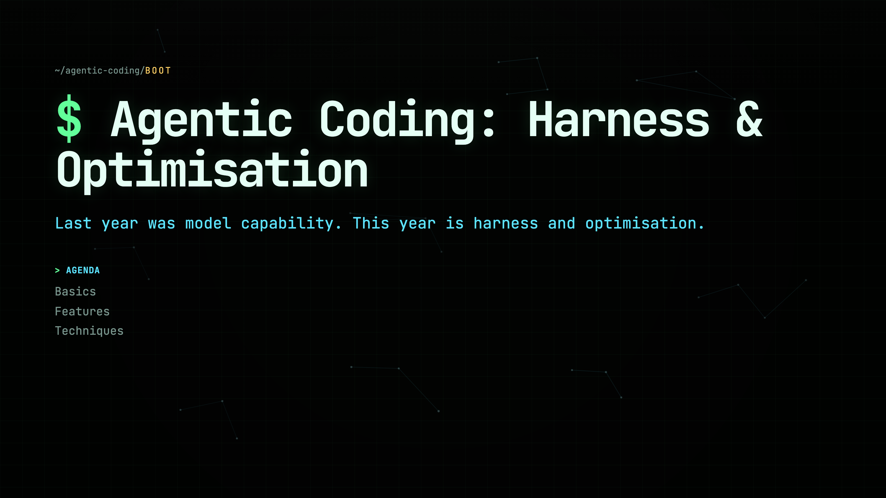
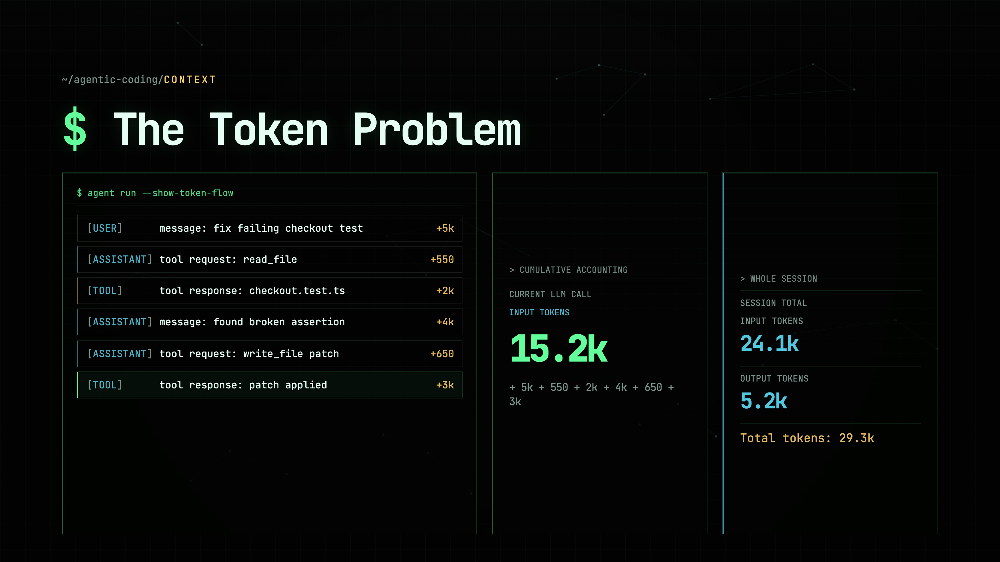
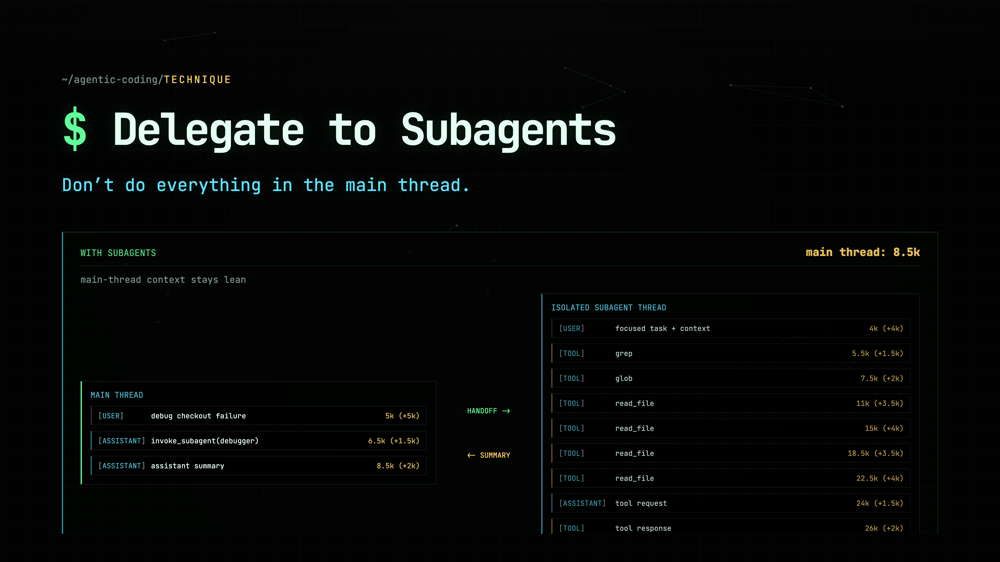
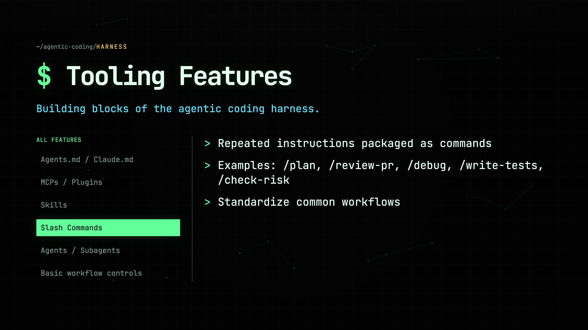
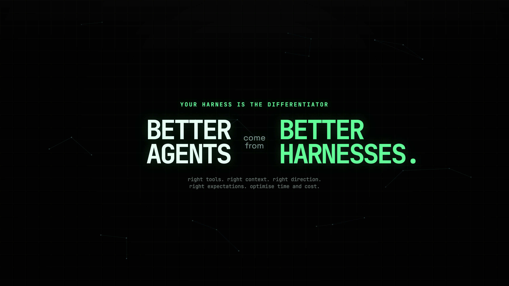

# Slidesmith AI

**Build presentation decks as code — and hand the repo to a coding agent to build them for you.** 🔥

> **You don't have to read this repo — your agent does.**
> Point your coding agent (Claude Code, Codex, Cursor, etc.) at this repo, give it your
> talk outline, and say *"build the slides."* It reads [`AGENTS.md`](./AGENTS.md),
> scaffolds a deck, and writes every slide for you. That's it. No need to learn
> the internals — that's the agent's job.

Slidesmith AI is a small React + TypeScript + Vite engine where each deck is a
folder of plain React components. A generic player gives you keyboard navigation,
progressive reveals, a deck picker, an optional laser pointer, and one-command
PDF / screenshot export. Because decks are just typed components, an AI coding
agent (Claude Code, Codex, Cursor, etc.) can scaffold and fill in a whole deck
from an outline — see [`AGENTS.md`](./AGENTS.md).

<p align="center">
  
</p>
<p align="center">
  
  
</p>
<p align="center">
  
  
</p>

*(All from the bundled `agentic-coding` example deck — generated by
`npm run screenshots`.)*

## Why build slides as code?

Because the whole power of the web is now your design surface. Traditional tools
(PowerPoint, Keynote, Google Slides) box you into static templates and clip-art.
Here, a slide is a component — so you can do things those tools simply can't:

- **Animations and transitions** that actually mean something — reveal a token
  count climbing, a diagram assembling itself, a value propagating through a
  pipeline, step by step on each click.
- **Live, interactive visuals** — real terminals, file trees, charts, diagrams,
  even tiny embedded apps. Anything you can render in a browser, you can present.
- **Pixel-perfect, on-brand design** — full control of typography, layout,
  motion, and theming; decks are crisp at any resolution and export to PDF.
- **Reusable building blocks** — write a panel or chart once, reuse it across
  every slide and every deck. Your decks get better over time, not stale.
- **Versioned and reviewable** — decks live in git. Diff them, branch them, let
  teammates (or agents) contribute.

And because it's code, **an AI agent can build it for you.** Describe the talk,
and the agent writes the slides — the tedious part disappears and you keep the
creative control.

> **This repo is just a starting point.** It ships with sensible boilerplate, a
> player, reusable components, a deck template, and export tooling. From here the
> sky is the limit — add 3D, scroll-driven motion, data viz, sound, live demos.
> Fork it and make it yours.

## Quickstart

```bash
npm install
npm run dev          # open http://localhost:5173 — pick a deck
```

Build and export:

```bash
npm run build                    # type-check + production build
npm run export:pdf -- <deckId>   # render a deck to exports/<deckId>.pdf
npm run screenshots -- <deckId>  # save slide PNGs to docs/screenshots/
```

## Let an agent build your deck

1. Open this repo in your coding agent.
2. Give it your talk outline (a few bullets per slide is plenty) and say:
   *"Build a new deck from this outline."*
3. The agent reads `AGENTS.md`, copies the deck template, writes one component
   per slide, and verifies with `npm run build`.

In Claude Code you can also run the **`/new-deck`** skill to scaffold a deck.

## Creating a deck by hand

1. `cp -r src/decks/_template src/decks/my-talk`
2. Edit `deck.ts` (`id` must match the folder), restyle `theme.css`, and write
   your slides in `slides.tsx`.
3. `npm run dev` — your deck appears in the picker automatically.

No registry edits required: decks under `src/decks/*/deck.ts` are
auto-discovered. See [`AGENTS.md`](./AGENTS.md) for the full guide and the `Deck`
contract.

## How it's organized

```
src/
  player/        # the generic deck player + picker (shared engine)
  components/    # reusable slide building blocks
  decks/
    types.ts     # the Deck contract
    registry.ts  # auto-discovers every deck folder
    _template/   # copy this to start a new deck
    <deck-id>/   # one self-contained folder per deck
scripts/         # PDF + screenshot exporters (Playwright)
```

The repo ships with one example deck, **`agentic-coding`** (a terminal-themed
talk), so you have a working reference to learn the conventions from.

## License

MIT — see [LICENSE](./LICENSE).
